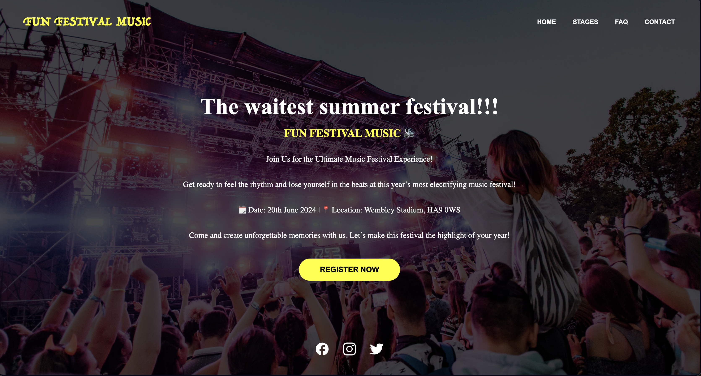
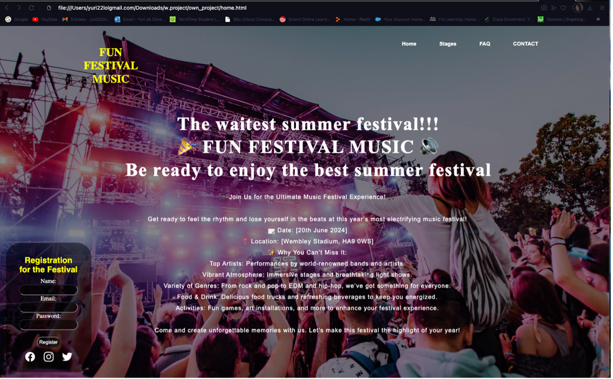
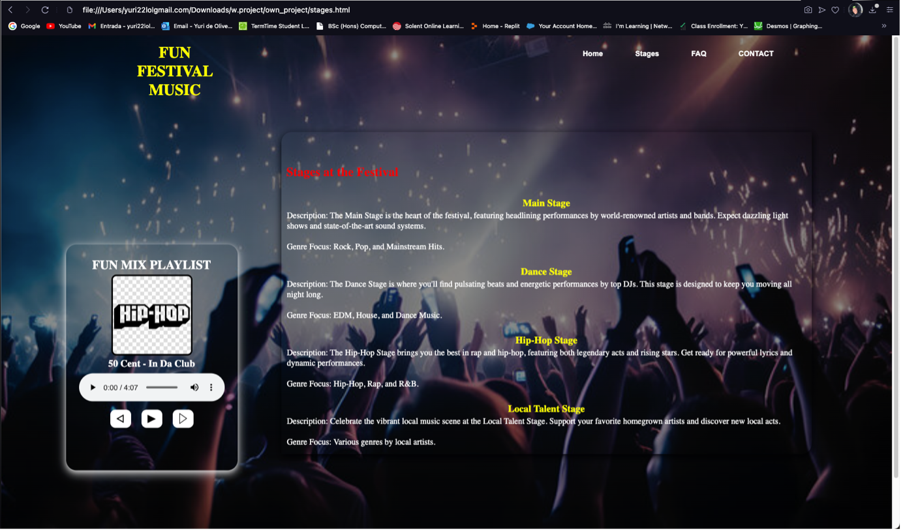
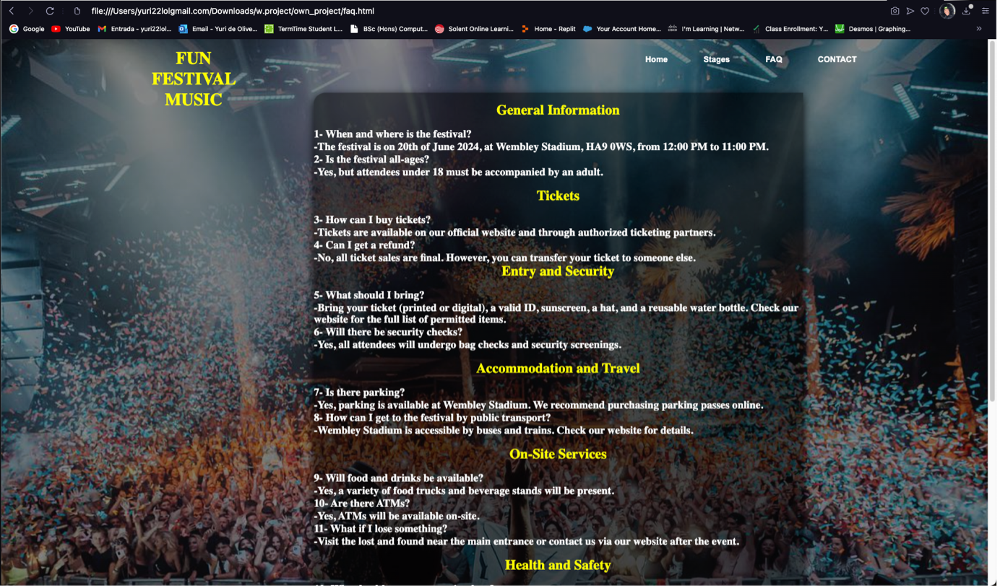
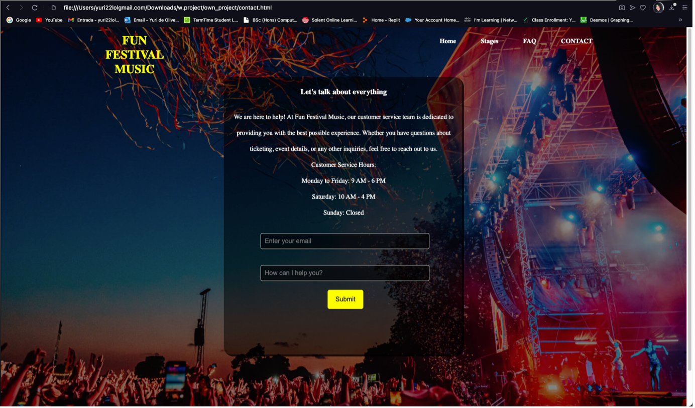

# MusicFestivalWeb – Interactive Festival Website



## Project Overview

MusicFestivalWeb is a full-stack festival website developed as part of a Web Technologies module. The application provides visitors with an engaging online experience where they can explore festival information, discover different music stages, register for the event, browse frequently asked questions, and contact the organisers.

Built using Python and Flask, the project combines responsive web design, JavaScript interactivity, SQLite database management, and multimedia integration to deliver an enjoyable user experience across multiple devices.

---

## My Role

This was an individual university project where I independently designed, developed, tested, and documented the complete website, including both the frontend and backend components.

---

# Core Features

- Developed a responsive multi-page website using Flask.
- Created a dynamic landing page with festival information.
- Built a registration system with client-side validation.
- Implemented an interactive music player with playlist controls.
- Designed dedicated FAQ and Contact pages.
- Added responsive layouts using CSS media queries.
- Implemented client-side and server-side form validation.
- Integrated SQLite using SQLAlchemy for data storage.
- Designed a consistent user interface across all pages.

---

# Technologies & Tools

## Backend

- Python
- Flask

## Frontend

- HTML5
- CSS3
- JavaScript

## Database

- SQLite
- SQLAlchemy

## Libraries & Tools

- Ionicons
- Visual Studio Code
- Git
- GitHub

---

# Key Features

- Responsive multi-page website
- Festival registration system
- Interactive music player
- Dynamic playlist controls
- FAQ knowledge base
- Contact form with instant feedback
- Client-side and server-side validation
- SQLite database integration
- Mobile-friendly responsive design

---

# Application Showcase

## Home Page



The landing page introduces visitors to the festival with event information, navigation links, and a registration form where users can create an account before attending the festival.

---

## Festival Registration


Visitors can register by entering their name, email address, and password. JavaScript validates user input before submission and provides immediate feedback after successful registration.

---

## Stages & Music Player



The Stages page presents the festival's different performance areas, including the Main Stage, Dance Stage, Hip-Hop Stage, and Local Talent Stage. An integrated music player allows users to play, pause, skip tracks, and dynamically updates the current song title and album artwork.

---

## Frequently Asked Questions



The FAQ section provides answers to common visitor questions covering festival information, tickets, travel, accommodation, health and safety, and on-site services.

---

## Contact Page



The Contact page allows visitors to submit enquiries through a contact form. JavaScript validates user input, displays a confirmation message, and resets the form after successful submission.

---

# Responsive Design

The website was designed using responsive CSS techniques to ensure a consistent experience across desktops, tablets, and mobile devices.

Media queries dynamically adjust:

- Navigation layout
- Content positioning
- Form elements
- Images
- Typography

This approach improves accessibility and usability regardless of screen size.

---

# Form Validation

User input is validated using both HTML5 and JavaScript before being processed.

Validation includes:

- Required fields
- Email format validation
- Password validation
- Confirmation messages
- Form reset after successful submission

This helps improve user experience while preventing incomplete or invalid submissions.

---

# Project Structure

```
MusicFestivalWeb/
│
├── app.py
├── templates/
│   ├── index.html
│   ├── stages.html
│   ├── faq.html
│   └── contact.html
│
├── static/
│   ├── css/
│   ├── js/
│   ├── images/
│   └── music/
│
└── database/
```

The project follows Flask's standard application structure by separating templates, static assets, backend logic, and database functionality.

---

# What I Learned

Developing MusicFestivalWeb strengthened my understanding of modern web development using Flask.

Throughout this project I gained practical experience with:

- Python web development using Flask
- HTML5 semantic structure
- CSS responsive design
- JavaScript DOM manipulation
- Form validation
- SQLAlchemy ORM
- SQLite database integration
- Multimedia integration
- Responsive web development
- User interface design

---

# Future Improvements

If I continued developing this application, I would:

- Add user authentication and login.
- Allow online ticket purchases.
- Integrate payment gateways.
- Build an administrator dashboard.
- Store festival registrations in a user management system.
- Add artist profiles and event schedules.
- Implement email confirmations.
- Improve accessibility following WCAG guidelines.

---

# Installation & Setup

## Clone the Repository

```bash
git clone https://github.com/yurihenrique98/MusicFestivalWeb.git

cd MusicFestivalWeb
```

---

## Create a Virtual Environment

```bash
python -m venv venv
```

Activate it:

### Windows

```bash
venv\Scripts\activate
```

### macOS / Linux

```bash
source venv/bin/activate
```

---

## Install Dependencies

```bash
pip install -r requirements.txt
```

---

## Run the Application

```bash
python app.py
```

The application will be available at:

```
http://127.0.0.1:5000
```

---

# Conclusion

MusicFestivalWeb demonstrates my ability to develop a responsive full-stack web application using Python, Flask, HTML, CSS, JavaScript, and SQLite. The project combines responsive design, multimedia integration, form validation, and database management to create an engaging festival website while following modern web development practices.
